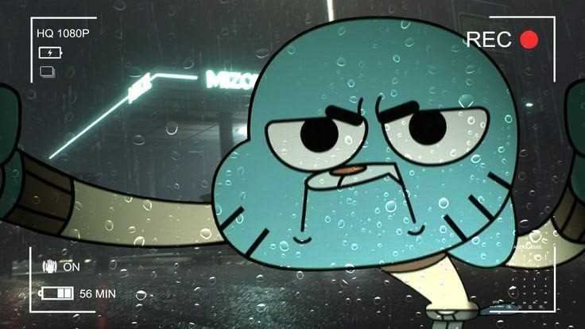

  

 

<h2 align="center">Ding-Dong here 🔥 !</h2>
<h3 align="center">Hey there 👋 I'm Ding-Dong</h3>

 

<h3 align="left">💫 Know About Me</h3>

  

<table>
  <tr>
    <td width="30%" align="center">
       
    </td>
    <td width="70%">
      
I'm a Computer Science undergrad at KNUST fueled by a deep obsession with cybersecurity and offensive security research. By day, you will find me studying school-related books and handouts. By night, I write Python and Bash scripts to automate my workflows and dive into Capture The Flag challenges.

      
When I'm not writing code, you can find me playing games, cooking, or managing my independent campus business. The rest of the time, I'm usually staring at my 27" 1440p monitor trying to figure out why my script broke.

    </td>
  </tr>
</table>

 

  <b>🌟 Follow Me on:</b>  
  
  
  

 

<h3 align="center">📚 Languages & tools I Have placed My Hands On</h3>

  

 

<h3 align="center">⚡ GitHub Stats</h3>

  
  

 

<h3 align="center">💻 Tech Stack:</h3>

  
  
  
  
  
   
  
  
  
  
  
   
  
  
  

 

<table align="center" width="100%" style="border: none;">
  <tr>
    <td width="50%" align="center">
      <h3>⭐ Top Projects</h3>
      <ul align="left">
        <li><b>SAFETRADE</b> A peer-to-peer campus escrow mobile app built in React Native and Spring Boot, designed to handle transactions securely and gracefully.</li>
         
        <li><b>OFFENSIVE SEC SCRIPTS</b> Custom terminal exploit tools and CTF automation built for my Parrot OS environment.</li>
         
        <li><b>BUSINESS OPERATIONS</b> Strategizing and scaling operations for my independent business on campus. Some things are better left a mystery.</li>
      </ul>
    </td>
    <td width="50%" align="center">
      <h3>✍️ Random Dev Quote</h3>
      
    </td>
  </tr>
</table>

 

<h3 align="center">Support Me 💰</h3>

  

 

  

